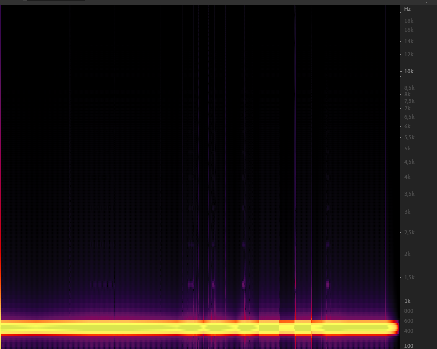

## Our Mastering Limiter Quality Test

### Test Case: 
**`440Hz sine wave with modified envelope exceeding 0db in some regions`**

> ### *Hard Clipper (Not Ours):*
> 

> ### *Soft Clipper (Not Ours):*
> 

> ### *[State-of-the-art Proprietary Limiter (Not Ours)](sota-limiter):*
> 

> ### 🎉 [**Matchering Limiter (OURS):**](.) 🎉
> 
