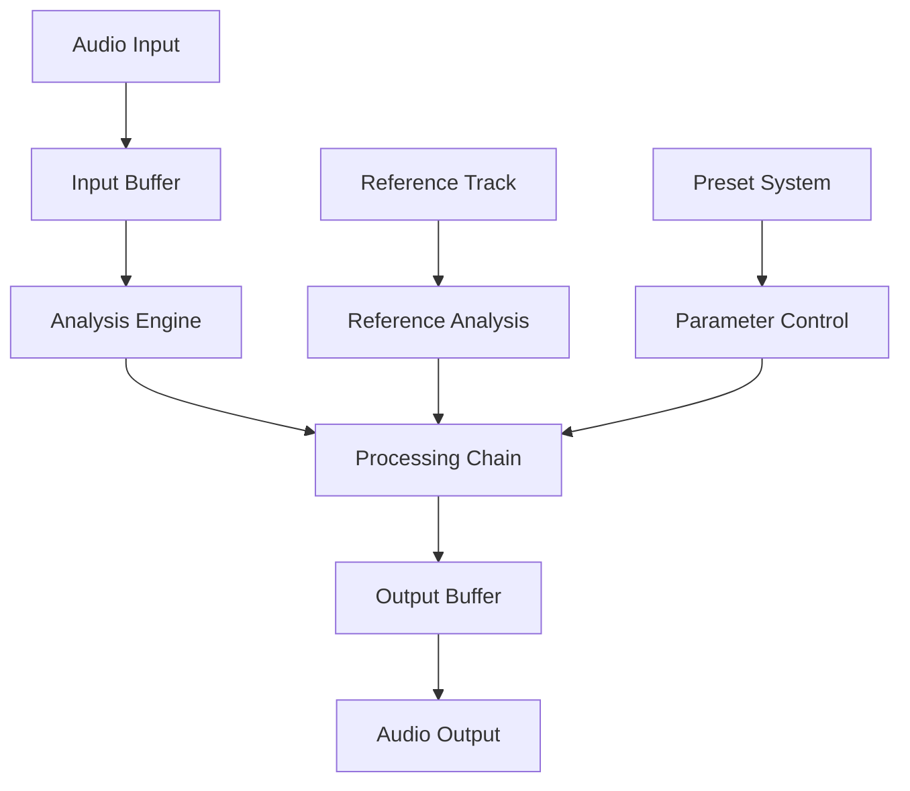

# Audio Processing Architecture

## Overview

The Matchering Player audio processing architecture is designed to provide real-time audio enhancement with minimal latency while maintaining professional-grade audio quality. The system uses a multi-threaded approach with lock-free processing chains and efficient buffer management.

## Core Architecture

### Processing Flow


## Buffer Management

### Buffer Configuration
```python
class BufferConfig:
    def __init__(self):
        self.block_size = 512  # Samples per block
        self.num_buffers = 8   # Number of buffers in pool
        self.sample_rate = 44100
        self.channels = 2
        self.format = np.float32
```

### Ring Buffer Implementation
```python
class RingBuffer:
    def __init__(self, config: BufferConfig):
        self.buffer = np.zeros(
            (config.num_buffers, config.block_size, config.channels),
            dtype=config.format
        )
        self.read_ptr = AtomicInteger(0)
        self.write_ptr = AtomicInteger(0)
        
    def write(self, data: np.ndarray) -> bool:
        """Write data to buffer if space available"""
        
    def read(self) -> Optional[np.ndarray]:
        """Read data from buffer if available"""
```

### Buffer Pool
```python
class BufferPool:
    def __init__(self, config: BufferConfig):
        self.free_buffers = Queue()
        self.active_buffers = Set()
        
    async def acquire(self) -> AudioBuffer:
        """Get buffer from pool"""
        
    def release(self, buffer: AudioBuffer):
        """Return buffer to pool"""
```

## Processing Chain

### Chain Configuration
```python
class ProcessingChain:
    def __init__(self):
        self.modules = []
        self.bypass = False
        self.latency = 0
        
    def add_module(self, module: ProcessingModule):
        """Add processing module to chain"""
        
    def remove_module(self, module_id: str):
        """Remove module from chain"""
        
    def process_block(self, buffer: AudioBuffer) -> AudioBuffer:
        """Process audio block through chain"""
```

### Processing Module Interface
```python
class ProcessingModule(ABC):
    @abstractmethod
    def process(self, buffer: AudioBuffer) -> AudioBuffer:
        """Process audio data"""
        
    @abstractmethod
    def update_params(self, params: dict):
        """Update processing parameters"""
        
    @property
    @abstractmethod
    def latency(self) -> int:
        """Return module latency in samples"""
```

## Real-time Processing

### Thread Model
```python
class ProcessingThread:
    def __init__(self):
        self.priority = REALTIME_PRIORITY_CLASS
        self.affinity = ProcessorAffinity.AUDIO
        self.state = ThreadState()
        
    async def process_loop(self):
        """Main processing loop"""
        while self.running:
            buffer = await self.input_queue.get()
            processed = self.chain.process_block(buffer)
            await self.output_queue.put(processed)
```

### Latency Management
```python
class LatencyManager:
    def __init__(self):
        self.total_latency = 0
        self.buffer_latency = 0
        self.processing_latency = 0
        
    def calculate_latency(self) -> int:
        """Calculate total signal path latency"""
        
    def optimize_latency(self):
        """Adjust parameters for optimal latency"""
```

## Processing Modules

### 1. Input Conditioning
```python
class InputConditioner(ProcessingModule):
    def __init__(self):
        self.gain = 1.0
        self.dc_filter = DCFilter()
        self.phase_rotation = PhaseRotation()
        
    def process(self, buffer: AudioBuffer) -> AudioBuffer:
        """Condition input signal"""
```

### 2. Dynamic Processor
```python
class DynamicProcessor(ProcessingModule):
    def __init__(self):
        self.bands = []
        self.crossover = MultibandCrossover()
        self.compressors = [Compressor() for _ in range(4)]
        
    def process(self, buffer: AudioBuffer) -> AudioBuffer:
        """Multi-band dynamic processing"""
```

### 3. Spectral Processor
```python
class SpectralProcessor(ProcessingModule):
    def __init__(self):
        self.fft_size = 2048
        self.hop_size = 512
        self.window = np.hanning(self.fft_size)
        
    def process(self, buffer: AudioBuffer) -> AudioBuffer:
        """Spectral domain processing"""
```

## Analysis Engine

### Real-time Analysis
```python
class AnalysisEngine:
    def __init__(self):
        self.analyzers = {
            'spectrum': SpectrumAnalyzer(),
            'loudness': LoudnessAnalyzer(),
            'correlation': CorrelationAnalyzer()
        }
        
    async def analyze_buffer(self, buffer: AudioBuffer) -> AnalysisResult:
        """Perform real-time analysis"""
```

### Reference Analysis
```python
class ReferenceAnalyzer:
    def __init__(self):
        self.cached_results = {}
        self.analysis_config = AnalysisConfig()
        
    async def analyze_reference(self, file_path: str) -> ReferenceStats:
        """Analyze reference track"""
```

## Preset System

### Preset Structure
```python
class ProcessingPreset:
    def __init__(self):
        self.name = ""
        self.category = ""
        self.parameters = {}
        self.metadata = {}
        
    def apply(self, chain: ProcessingChain):
        """Apply preset to processing chain"""
        
    def save(self, path: str):
        """Save preset to file"""
```

### Preset Management
```python
class PresetManager:
    def __init__(self):
        self.presets = {}
        self.active_preset = None
        
    def load_preset(self, name: str):
        """Load and apply preset"""
        
    def save_preset(self, name: str, chain: ProcessingChain):
        """Save current settings as preset"""
```

## A/B Comparison

### Comparison System
```python
class ABComparison:
    def __init__(self):
        self.buffer_a = None
        self.buffer_b = None
        self.active_buffer = 'A'
        
    def switch_buffer(self):
        """Switch between A and B"""
        
    def update_buffer(self, buffer: AudioBuffer, slot: str):
        """Update buffer A or B"""
```

## Performance Optimization

### SIMD Processing
```python
class SIMDProcessor:
    def __init__(self):
        self.enabled = check_simd_support()
        self.vectors = align_memory(16)
        
    def process_vector(self, data: np.ndarray):
        """SIMD-optimized processing"""
```

### GPU Acceleration
```python
class GPUProcessor:
    def __init__(self):
        self.device = select_gpu_device()
        self.memory_pool = GPUMemoryPool()
        
    def process_gpu(self, buffer: AudioBuffer):
        """GPU-accelerated processing"""
```

## Error Recovery

### Error Handling
```python
class ErrorHandler:
    def __init__(self):
        self.error_states = []
        self.recovery_actions = {}
        
    async def handle_error(self, error: ProcessingError):
        """Handle processing errors"""
        
    def recover_state(self):
        """Recover from error state"""
```

### Graceful Degradation
```python
class ProcessingDegradation:
    def __init__(self):
        self.quality_levels = []
        self.current_level = 0
        
    def adjust_quality(self, load: float):
        """Adjust processing quality based on load"""
```

## Performance Monitoring

### Processing Metrics
```python
class PerformanceMonitor:
    def __init__(self):
        self.metrics = {
            'cpu_load': 0.0,
            'latency': 0,
            'dropouts': 0,
            'processing_time': 0.0
        }
        
    def update_metrics(self):
        """Update performance metrics"""
```

### Quality Control
```python
class QualityControl:
    def __init__(self):
        self.thd = 0.0
        self.snr = 0.0
        self.headroom = 0.0
        
    def check_quality(self, buffer: AudioBuffer):
        """Check audio quality metrics"""
```

## Configuration Management

### Processing Configuration
```python
class ProcessingConfig:
    sample_rate: int = 44100
    block_size: int = 512
    num_channels: int = 2
    bit_depth: int = 32
    max_latency: int = 2048
    
    processing_mode: str = 'realtime'
    quality_preset: str = 'high'
    enable_gpu: bool = False
```

### System Settings
```python
class SystemSettings:
    buffer_strategy: str = 'fixed'
    thread_priority: int = 'realtime'
    memory_limit: int = 512 * 1024 * 1024
    enable_simd: bool = True
    monitor_performance: bool = True
```

## Implementation Guidelines

### 1. Optimization Rules
- Use lock-free algorithms where possible
- Minimize memory allocation in audio path
- Implement SIMD operations for core processing
- Use GPU acceleration for spectral processing
- Maintain buffer alignment for optimal performance

### 2. Error Handling
- Implement graceful degradation
- Provide fallback processing paths
- Monitor system resources
- Handle audio dropouts
- Maintain processing stability

### 3. Testing Requirements
- Real-time performance validation
- Audio quality verification
- Stress testing under load
- Error recovery testing
- Long-term stability testing