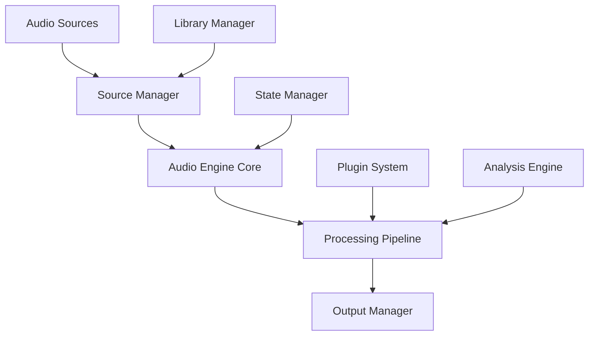
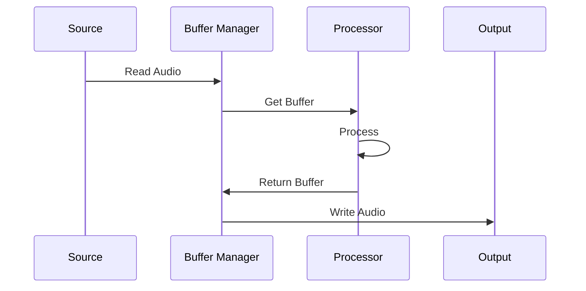
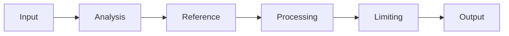

# Matchering Player Architecture

## System Overview

The Matchering Player architecture is designed around a high-performance audio processing core that enables real-time remastering while maintaining the responsiveness and reliability expected from a media player.



## Core Components

### 1. Audio Engine Core

```python
class AudioEngine:
    def __init__(self):
        self.buffer_manager = BufferManager()
        self.source_manager = SourceManager()
        self.processing_pipeline = ProcessingPipeline()
        self.output_manager = OutputManager()
        self.state = PlaybackState()

    async def process_audio(self, buffer: AudioBuffer) -> AudioBuffer:
        """Main audio processing loop with non-blocking operations"""
        
    def update_processing_chain(self, chain: ProcessingChain):
        """Update processing modules dynamically"""
```

#### Key Features
- Zero-copy buffer management
- Lock-free audio processing
- Real-time priority scheduling
- Dynamic processing chain
- Multi-threaded processing

### 2. Processing Pipeline

```python
class ProcessingPipeline:
    def __init__(self):
        self.modules = []
        self.analysis_engine = AnalysisEngine()
        self.reference_processor = ReferenceProcessor()
        
    def process_block(self, buffer: AudioBuffer) -> AudioBuffer:
        """Process a single audio block through the chain"""
        
    def update_module(self, module_id: str, params: dict):
        """Update module parameters in real-time"""
```

#### Processing Modules
- Input conditioning
- Dynamic EQ
- Multi-band compression
- Stereo enhancement
- Limiter
- Reference matching

### 3. Buffer Management

```python
class BufferManager:
    def __init__(self, config: BufferConfig):
        self.read_buffer = RingBuffer()
        self.write_buffer = RingBuffer()
        self.processing_buffers = BufferPool()
        
    async def get_next_buffer(self) -> AudioBuffer:
        """Get next buffer for processing non-blocking"""
        
    def return_buffer(self, buffer: AudioBuffer):
        """Return processed buffer to pool"""
```

#### Features
- Lock-free ring buffers
- Pre-allocated buffer pool
- Zero-copy operations
- Automatic buffer sizing
- Latency management

### 4. Plugin System

```python
class PluginManager:
    def __init__(self):
        self.plugins = {}
        self.hooks = defaultdict(list)
        
    def register_plugin(self, plugin: AudioPlugin):
        """Register new audio processing plugin"""
        
    def get_processing_chain(self) -> ProcessingChain:
        """Build processing chain from active plugins"""
```

#### Plugin Types
- Processing modules
- Analysis tools
- Visualizations
- Format handlers
- UI components

### 5. State Management

```python
class StateManager:
    def __init__(self):
        self.playback_state = PlaybackState()
        self.processing_state = ProcessingState()
        self.analysis_state = AnalysisState()
        
    def update_state(self, event: StateEvent):
        """Update system state and notify observers"""
```

#### State Types
- Playback control
- Processing parameters
- Analysis results
- UI state
- Plugin state

### 6. Analysis Engine

```python
class AnalysisEngine:
    def __init__(self):
        self.analyzers = {}
        self.results_cache = Cache()
        
    async def analyze_buffer(self, buffer: AudioBuffer) -> AnalysisResult:
        """Perform real-time analysis on audio buffer"""
        
    def get_analysis_data(self, type: AnalysisType) -> AnalysisData:
        """Get cached analysis results"""
```

#### Analysis Types
- Spectrum analysis
- Loudness measurement
- Phase correlation
- Dynamic range
- Genre detection

## Real-Time Processing

### Buffer Flow


### Processing Chain


## Performance Considerations

### Latency Management
- Buffer size optimization
- Processing prioritization
- Thread scheduling
- Memory management
- Cache optimization

### Resource Usage
- CPU load balancing
- Memory footprint
- GPU acceleration
- Power management
- Thermal management

## Thread Model

### Main Threads
1. **Audio Thread**
   - Highest priority
   - Real-time processing
   - Buffer management
   - Minimal blocking

2. **Processing Thread**
   - High priority
   - Plugin execution
   - Analysis processing
   - State updates

3. **UI Thread**
   - Normal priority
   - User interface
   - Non-critical updates
   - Event handling

## Error Handling

### Recovery Strategies
1. **Audio Glitches**
   - Buffer underrun recovery
   - Processing chain bypass
   - Automatic reinitialization
   - Graceful degradation

2. **Plugin Failures**
   - Module isolation
   - Safe state fallback
   - Error reporting
   - Automatic recovery

## Configuration Management

### System Configuration
```python
class SystemConfig:
    audio_config: AudioConfig
    processing_config: ProcessingConfig
    plugin_config: PluginConfig
    analysis_config: AnalysisConfig
```

### Dynamic Updates
- Hot-reload support
- Parameter validation
- State persistence
- Profile management
- Preset system

## Extension Points

### Plugin API
```python
class AudioPlugin:
    def process_audio(self, buffer: AudioBuffer) -> AudioBuffer:
        """Process audio data"""
        
    def update_params(self, params: dict):
        """Update processing parameters"""
```

### Analysis API
```python
class Analyzer:
    def analyze(self, buffer: AudioBuffer) -> AnalysisResult:
        """Perform audio analysis"""
        
    def get_results(self) -> AnalysisData:
        """Get analysis results"""
```

## Integration Points

### Audio Backends
- WASAPI
- ASIO
- CoreAudio
- ALSA
- PulseAudio
- JACK

### Plugin Formats
- VST3
- AU
- CLAP
- Native format

### File Formats
- WAV/AIFF
- FLAC/ALAC
- MP3/AAC
- DSD
- MQA

## Development Guidelines

### Code Organization
```
src/
├── core/
│   ├── engine/
│   ├── processing/
│   ├── analysis/
│   └── plugins/
├── audio/
│   ├── buffer/
│   ├── formats/
│   └── backend/
├── ui/
│   ├── components/
│   ├── state/
│   └── views/
└── utils/
```

### Best Practices
- Lock-free algorithms
- Memory pooling
- SIMD optimization
- Error recovery
- Testing strategy

## Implementation Priorities

### Phase 1: Core Engine
- Basic playback
- Buffer management
- Thread model
- Error handling

### Phase 2: Processing
- Processing chain
- Real-time analysis
- Plugin system
- State management

### Phase 3: Advanced Features
- Reference processing
- Machine learning
- Advanced analysis
- UI integration

## Performance Targets

### Audio Quality
- Latency < 5ms
- THD < -120dB
- Dynamic range > 120dB
- Sample rate up to 384kHz
- Bit depth up to 32-bit float

### System Resources
- CPU usage < 15%
- Memory < 500MB
- Disk I/O < 10MB/s
- GPU optional
- Power efficient