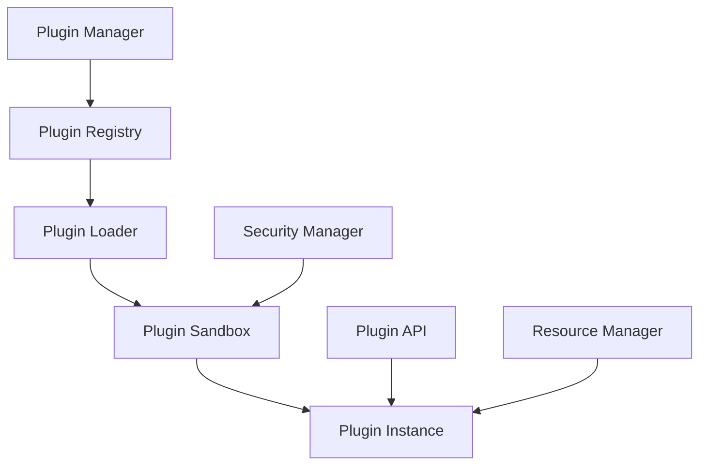

# Matchering Player Plugin System

## Overview

The Matchering Player plugin system provides a flexible and secure way to extend the player's functionality through various plugin types. The system is designed to be both powerful for developers and safe for users.

## Plugin Architecture

### High-Level Design


## Core Components

### Plugin Manager
```python
class PluginManager:
    def __init__(self):
        self.registry = PluginRegistry()
        self.loader = PluginLoader()
        self.sandbox = PluginSandbox()
        
    async def load_plugin(self, path: str) -> Plugin:
        """Load and initialize plugin"""
        
    def unload_plugin(self, plugin_id: str):
        """Safely unload plugin"""
        
    def get_plugins_by_type(self, type: PluginType) -> List[Plugin]:
        """Get all plugins of specific type"""
```

### Plugin Types

```python
class PluginType(Enum):
    PROCESSOR = "processor"      # Audio processing plugins
    ANALYZER = "analyzer"        # Audio analysis plugins
    VISUALIZER = "visualizer"    # Visualization plugins
    FORMAT = "format"           # File format support
    INTERFACE = "interface"     # UI components
    PRESET = "preset"          # Preset providers
```

## Plugin Interface

### Base Plugin
```python
class Plugin(ABC):
    @property
    @abstractmethod
    def id(self) -> str:
        """Unique plugin identifier"""
        
    @property
    @abstractmethod
    def name(self) -> str:
        """Human-readable name"""
        
    @property
    @abstractmethod
    def version(self) -> str:
        """Plugin version"""
        
    @property
    @abstractmethod
    def type(self) -> PluginType:
        """Plugin type"""
        
    @abstractmethod
    async def initialize(self):
        """Initialize plugin"""
        
    @abstractmethod
    async def cleanup(self):
        """Cleanup resources"""
```

### Processor Plugin
```python
class ProcessorPlugin(Plugin):
    @abstractmethod
    def process_audio(self, buffer: AudioBuffer) -> AudioBuffer:
        """Process audio data"""
        
    @abstractmethod
    def get_parameters(self) -> List[Parameter]:
        """Get processing parameters"""
        
    @abstractmethod
    def update_parameters(self, params: Dict[str, Any]):
        """Update processing parameters"""
        
    @property
    @abstractmethod
    def latency(self) -> int:
        """Return processing latency"""
```

### Analyzer Plugin
```python
class AnalyzerPlugin(Plugin):
    @abstractmethod
    def analyze_audio(self, buffer: AudioBuffer) -> AnalysisResult:
        """Analyze audio data"""
        
    @abstractmethod
    def get_analysis_types(self) -> List[str]:
        """Get supported analysis types"""
        
    @abstractmethod
    def get_result(self, type: str) -> Any:
        """Get analysis results"""
```

### Visualizer Plugin
```python
class VisualizerPlugin(Plugin):
    @abstractmethod
    def update(self, data: AudioBuffer):
        """Update visualization data"""
        
    @abstractmethod
    def render(self, context: RenderContext):
        """Render visualization"""
        
    @abstractmethod
    def get_size_requirements(self) -> Size:
        """Get required rendering size"""
```

## Plugin Manifest

### Manifest Structure
```json
{
  "id": "com.example.plugin",
  "name": "Example Plugin",
  "version": "1.0.0",
  "type": "processor",
  "api_version": "1.0",
  "entry_point": "plugin.py",
  "dependencies": {
    "numpy": ">=1.20.0",
    "scipy": ">=1.7.0"
  },
  "permissions": [
    "audio_processing",
    "file_read"
  ],
  "metadata": {
    "author": "Example Author",
    "description": "Example plugin description",
    "website": "https://example.com"
  }
}
```

## Security System

### Permission System
```python
class PluginPermission(Enum):
    AUDIO_PROCESSING = "audio_processing"
    FILE_READ = "file_read"
    FILE_WRITE = "file_write"
    NETWORK = "network"
    UI = "ui"
    SYSTEM = "system"

class SecurityManager:
    def __init__(self):
        self.permissions = {}
        self.sandbox = Sandbox()
        
    def check_permission(self, plugin_id: str, 
                        permission: PluginPermission) -> bool:
        """Check if plugin has permission"""
        
    def grant_permission(self, plugin_id: str, 
                        permission: PluginPermission):
        """Grant permission to plugin"""
```

### Resource Management
```python
class ResourceManager:
    def __init__(self):
        self.memory_limit = 100 * 1024 * 1024  # 100MB
        self.cpu_limit = 0.1  # 10% CPU
        
    def allocate_resources(self, plugin_id: str, 
                          resources: ResourceRequest):
        """Allocate resources to plugin"""
        
    def monitor_usage(self, plugin_id: str) -> ResourceUsage:
        """Monitor plugin resource usage"""
```

## Plugin SDK

### Development Kit
```python
class PluginSDK:
    def __init__(self):
        self.api = PluginAPI()
        self.tools = DevelopmentTools()
        self.templates = PluginTemplates()
        
    def create_plugin(self, type: PluginType, name: str):
        """Create new plugin project"""
        
    def build_plugin(self, path: str):
        """Build plugin package"""
        
    def test_plugin(self, path: str):
        """Test plugin functionality"""
```

### Plugin API
```python
class PluginAPI:
    def register_processor(self, processor: ProcessorPlugin):
        """Register audio processor"""
        
    def register_analyzer(self, analyzer: AnalyzerPlugin):
        """Register audio analyzer"""
        
    def register_visualizer(self, visualizer: VisualizerPlugin):
        """Register visualizer"""
        
    def get_host_info(self) -> HostInfo:
        """Get host application info"""
```

## Plugin Communication

### Event System
```python
class PluginEventSystem:
    def __init__(self):
        self.subscribers = defaultdict(list)
        
    def subscribe(self, event_type: str, callback: Callable):
        """Subscribe to plugin events"""
        
    def publish(self, event_type: str, data: Any):
        """Publish plugin event"""
```

### Inter-Plugin Communication
```python
class PluginMessenger:
    def __init__(self):
        self.channels = {}
        
    async def send_message(self, target: str, message: Message):
        """Send message to another plugin"""
        
    def register_handler(self, handler: MessageHandler):
        """Register message handler"""
```

## Plugin Store

### Store Interface
```python
class PluginStore:
    def __init__(self):
        self.repository = PluginRepository()
        self.validator = PluginValidator()
        
    async def search_plugins(self, query: str) -> List[PluginInfo]:
        """Search available plugins"""
        
    async def install_plugin(self, plugin_id: str):
        """Install plugin from store"""
        
    async def update_plugin(self, plugin_id: str):
        """Update installed plugin"""
```

## Development Guidelines

### 1. Plugin Structure
```
plugin_root/
├── manifest.json
├── plugin.py
├── requirements.txt
├── assets/
│   ├── icons/
│   └── presets/
├── docs/
│   ├── README.md
│   └── API.md
└── tests/
    └── test_plugin.py
```

### 2. Best Practices
- Use async/await for I/O operations
- Implement proper cleanup
- Handle errors gracefully
- Cache expensive computations
- Optimize resource usage
- Follow security guidelines

### 3. Testing Requirements
- Unit tests for functionality
- Performance benchmarks
- Resource usage tests
- Security validation
- Integration tests

## Plugin Categories

### 1. Audio Processors
- Equalizers
- Compressors
- Effects
- Spatial processors
- Mastering tools

### 2. Analyzers
- Spectrum analyzers
- Loudness meters
- Phase correlation
- Genre detection
- Quality analysis

### 3. Visualizers
- Waveform displays
- Spectrum visualizers
- Meter bridges
- 3D visualizations
- Custom UIs

### 4. Format Handlers
- Audio formats
- Playlist formats
- Metadata handlers
- Stream protocols
- Container formats

## Implementation Example

### Simple Processor Plugin
```python
@plugin(type=PluginType.PROCESSOR)
class ExampleProcessor(ProcessorPlugin):
    def __init__(self):
        self.params = {
            'gain': 1.0,
            'threshold': -20.0
        }
        
    def process_audio(self, buffer):
        # Process audio data
        return processed_buffer
        
    def get_parameters(self):
        return [
            Parameter('gain', float, 0.0, 2.0),
            Parameter('threshold', float, -60.0, 0.0)
        ]
```

### Simple Analyzer Plugin
```python
@plugin(type=PluginType.ANALYZER)
class ExampleAnalyzer(AnalyzerPlugin):
    def __init__(self):
        self.fft_size = 2048
        self.results = {}
        
    def analyze_audio(self, buffer):
        # Perform analysis
        return analysis_result
        
    def get_analysis_types(self):
        return ['spectrum', 'loudness']
```

## Error Handling

### Plugin Errors
```python
class PluginError(Exception):
    def __init__(self, plugin_id: str, message: str):
        self.plugin_id = plugin_id
        self.message = message
        
class PluginLoadError(PluginError):
    pass

class PluginRuntimeError(PluginError):
    pass
```

### Error Recovery
```python
class PluginErrorHandler:
    def __init__(self):
        self.error_policies = {}
        
    async def handle_error(self, error: PluginError):
        """Handle plugin errors"""
        
    def set_policy(self, plugin_id: str, policy: ErrorPolicy):
        """Set error handling policy"""
```

## Performance Guidelines

### 1. Resource Usage
- Memory limits per plugin
- CPU usage restrictions
- I/O bandwidth limits
- GPU resource sharing
- Storage quotas

### 2. Optimization
- Buffer recycling
- SIMD operations
- Parallel processing
- Caching strategy
- Load balancing

### 3. Monitoring
- Resource tracking
- Performance metrics
- Error logging
- Usage statistics
- Health checks