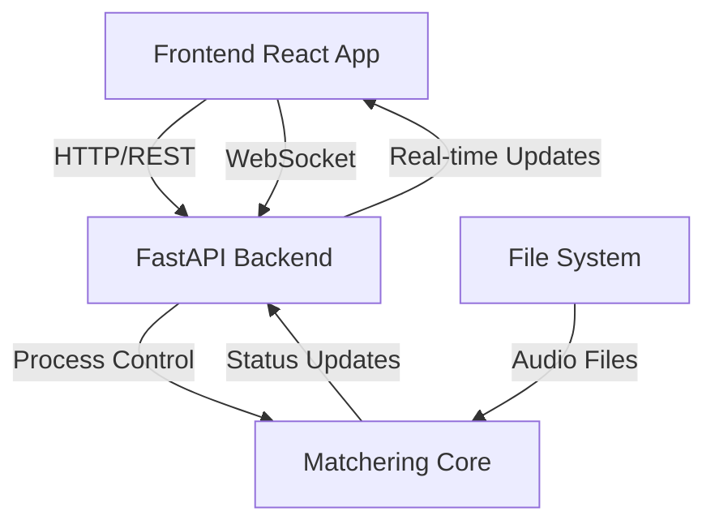

# Matchering UI Architecture

## Overview

The new Matchering UI architecture replaces the current Tkinter-based interface with a modern web-based solution that provides better user experience, cross-platform compatibility, and enhanced features for audio processing visualization and control.

## Architecture Components

### Frontend (React)
- **Technology Stack**
  - React 18+ for UI components
  - TypeScript for type safety
  - Vite for build tooling
  - TanStack Query for data fetching
  - Zustand for state management
  - Wavesurfer.js for audio visualization

- **Key Features**
  - Real-time audio waveform visualization
  - Drag-and-drop file upload
  - Live processing feedback
  - Responsive design for desktop/tablet
  - Keyboard shortcuts for common actions
  - Dark/light theme support

### Backend (FastAPI)
- **Technology Stack**
  - FastAPI for REST API
  - WebSockets for real-time updates
  - Pydantic for data validation
  - aiofiles for async file handling

- **Key Features**
  - RESTful API endpoints
  - WebSocket connections for live updates
  - File upload handling
  - Processing status monitoring
  - Results caching
  - Configuration management

### Integration Layer
- **Core Processing Integration**
  - Async job queue for processing tasks
  - Status monitoring and progress updates
  - Configuration validation and mapping
  - Results management and caching

## Component Communication



## API Endpoints

### REST Endpoints
- `/api/v1/files`
  - POST: Upload audio files
  - GET: List uploaded files
  - DELETE: Remove files
- `/api/v1/process`
  - POST: Start processing
  - GET: Get process status
  - DELETE: Cancel processing
- `/api/v1/config`
  - GET: Get current config
  - PUT: Update config
- `/api/v1/results`
  - GET: Get processing results
  - POST: Export results

### WebSocket Events
- `processing_status`: Real-time processing updates
- `audio_analysis`: Live audio analysis data
- `error_notification`: Error events
- `completion_status`: Process completion events

## Frontend Component Structure

```
src/
├── components/
│   ├── AudioPlayer/
│   ├── WaveformView/
│   ├── ProcessingControls/
│   ├── FileUpload/
│   ├── ConfigPanel/
│   └── ResultsView/
├── hooks/
│   ├── useAudioProcessing
│   ├── useWebSocket
│   └── useConfig
├── store/
│   ├── processingStore
│   └── configStore
└── api/
    └── client
```

## Security Considerations

- File upload validation and sanitization
- WebSocket connection authentication
- API rate limiting
- File size restrictions
- Temporary file cleanup
- CORS configuration

## Development Phases

1. **Phase 1: Core Infrastructure**
   - Setup FastAPI backend
   - Basic React frontend shell
   - File upload functionality
   - Simple processing status display

2. **Phase 2: Audio Processing UI**
   - Waveform visualization
   - Processing controls
   - Basic real-time updates

3. **Phase 3: Advanced Features**
   - Configuration management
   - Results preview and export
   - Progress visualization
   - Error handling

4. **Phase 4: Polish**
   - Performance optimization
   - UI/UX improvements
   - Documentation
   - Testing

## Performance Considerations

- Chunked file uploads for large audio files
- WebSocket connection management
- Frontend memory management for audio visualization
- Results caching strategy
- Efficient state updates

## Testing Strategy

- Frontend unit tests with React Testing Library
- API integration tests with pytest
- End-to-end testing with Playwright
- Performance testing for file uploads and processing
- Cross-browser compatibility testing

## Deployment Considerations

- Frontend static file serving
- Backend process management
- WebSocket scaling
- File storage configuration
- Monitoring and logging setup

## Future Considerations

- Mobile responsive design
- Batch processing capabilities
- User presets and favorites
- Processing history
- Cloud storage integration
- Collaborative features